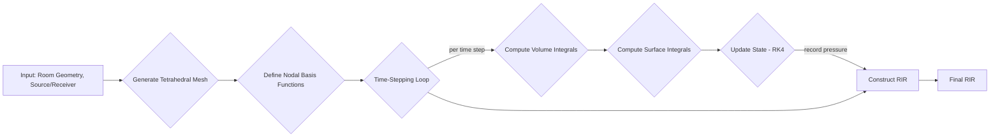

# Discontinuous Galerkin Finite Element Method (DG-FEM) Methodology

This engine implements a time-domain acoustic wave propagation solver based on the Discontinuous Galerkin Finite Element Method (DG-FEM). It is a wave-based method that numerically solves the acoustic wave equation, making it highly accurate for low-to-mid frequencies where phenomena like diffraction and room modes are prominent.

Unlike geometric methods, DG-FEM discretizes the entire room volume into a mesh of small elements (tetrahedra) and solves for the sound pressure at nodes within these elements. This approach captures the full wave physics of sound propagation.

### Block Diagram



## Core Equations & Principles

The DG-FEM solver directly discretizes and solves the first-order, time-domain acoustic wave equations, which describe the relationship between acoustic pressure $p$ and particle velocity $\mathbf{v}$:

$$
\frac{\partial p}{\partial t} + \rho_0 c^2 \nabla \cdot \mathbf{v} = 0
$$

$$
\frac{\partial \mathbf{v}}{\partial t} + \frac{1}{\rho_0} \nabla p = 0
$$

where:
-   $p$ is the acoustic pressure.
-   $\mathbf{v}$ is the particle velocity vector.
-   $\rho_0$ is the density of the medium (air).
-   $c$ is the speed of sound.
-   $\rho_0 c^2$ is the bulk modulus of the medium.

The Discontinuous Galerkin method allows the solution to be discontinuous across element boundaries, which provides flexibility for meshing complex geometries and adapting the polynomial order of the basis functions ($p$-adaptivity).

## Implementation Details

-   **Meshing:** The room volume is discretized into an unstructured mesh of tetrahedra using the Delaunay triangulation algorithm. The mesh density is controlled by a `mesh_resolution` parameter.
-   **Basis Functions:** High-order Lagrange polynomials are used as basis functions within each element on a set of optimized Warp & Blend nodes. The `polynomial_order` parameter controls the accuracy of the solution.
-   **Time Integration:** An explicit fourth-order Runge-Kutta scheme is used for stable and accurate time-stepping. The time step size is determined by the CFL condition to ensure numerical stability.
-   **Numerical Flux:** An upwind flux (Lax-Friedrichs) is used to compute the interaction between adjacent, discontinuous elements, ensuring correct wave propagation across the mesh.
-   **GPU Acceleration:** The engine can leverage CuPy for GPU acceleration, which significantly speeds up the computationally intensive parts of the simulation.

## Seminal Papers

1.  **Käser, M., & Dumbser, M. (2006).** *An arbitrary high-order discontinuous Galerkin method for elastic waves on unstructured meshes—I. The two-dimensional isotropic case with exterior forces*. Geophysical Journal International, 166(2), 855-877.

```bibtex
@article{kaser2006arbitrary,
  title={An arbitrary high-order discontinuous {G}alerkin method for elastic waves on unstructured meshes—{I}. {T}he two-dimensional isotropic case with exterior forces},
  author={K{\"a}ser, Martin and Dumbser, Michael},
  journal={Geophysical Journal International},
  volume={166},
  number={2},
  pages={855--877},
  year={2006},
  publisher={Oxford University Press}
}
```

2.  **Hesthaven, J. S., & Warburton, T. (2008).** *Nodal Discontinuous Galerkin Methods: Algorithms, Analysis, and Applications*. Springer Science & Business Media.

```bibtex
@book{hesthaven2008nodal,
  title={Nodal Discontinuous Galerkin Methods: Algorithms, Analysis, and Applications},
  author={Hesthaven, Jan S and Warburton, Tim},
  year={2008},
  publisher={Springer Science \& Business Media}
}
```
