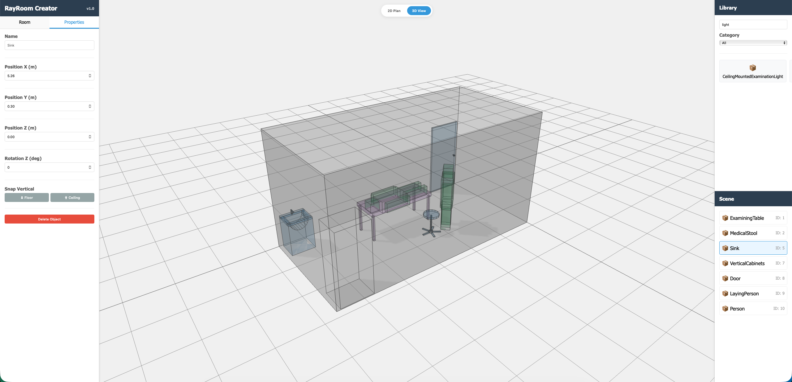
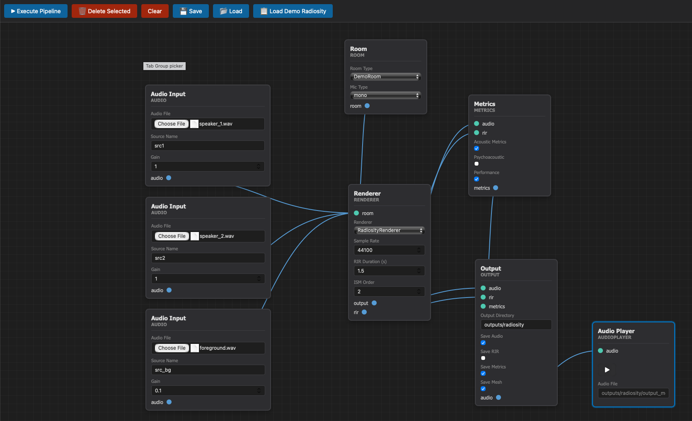

# RayRoom Web Tools

The `web` directory contains visual, browser-based tools for designing and configuring RayRoom acoustic simulations. These tools provide intuitive graphical interfaces that eliminate the need for manual JSON configuration and Python scripting.

## Overview

RayRoom Web Tools consist of two complementary applications:

1. **Room Creator** - Design and configure acoustic room geometries
2. **Blueprint Editor** - Create and execute complete audio simulation pipelines

Together, these tools provide a complete visual workflow from room design to simulation execution.

---

## 🏗️ Room Creator

A visual web-based editor for designing and configuring acoustic rooms for RayRoom audio simulations. Create custom room geometries, place furniture, audio sources, and receivers with an intuitive 2D/3D interface.



### Key Features

- **Visual Room Design**: Create custom room geometries using a 2D top-down view with polygon drawing tools
- **Room Templates**: Quick-start with pre-configured shoebox room templates
- **Asset Library**: Browse and place furniture, audio sources, and receivers from the RayRoom object library
- **3D Preview**: Real-time 3D visualization of your room design
- **Interactive Editing**: Click and drag to position objects, adjust properties in real-time
- **Export Configuration**: Save room configurations as JSON for use in RayRoom simulations

### Quick Start

```bash
python web/room_creator/launch_room_creator.py
```

This will scan the RayRoom object library, generate the HTML interface, and open the room creator in your default web browser.

### Use Cases

- Design custom room geometries for acoustic simulations
- Place and configure audio sources and receivers
- Visualize room layouts before running simulations
- Export room configurations for use in Blueprint Editor or Python scripts

For detailed documentation, see [Room Creator README](./room_creator/README.md).

---

## 🗺️ Blueprint Editor

A visual node-based editor for creating RayRoom audio simulation pipelines, inspired by Unreal Engine's Blueprint system. Design complete audio processing workflows by connecting nodes visually.



### Key Features

- **Visual Node Editor**: Drag-and-drop interface with nodes for Room, Sources, Receivers, Renderers, Audio Inputs, Metrics, Effects, and Output
- **Blueprint-Style UI**: Dark theme with rounded nodes and connection lines, similar to Unreal Engine Blueprints
- **Pipeline Execution**: Execute complete audio simulation pipelines directly from the visual graph
- **Save/Load**: Save and load blueprint configurations as JSON files

### Quick Start

```bash
python web/blueprint_pipeline/launch_blueprint_editor.py
```

This will start the backend server on `http://localhost:8000` and open the blueprint editor in your default browser.

### Use Cases

- Design complex audio simulation pipelines without writing code
- Experiment with different renderers (Hybrid, Radiosity, Spectral, Raytracing)
- Apply audio effects and compute acoustic metrics
- Save and share pipeline configurations

For detailed documentation, see [Blueprint Editor README](./blueprint_pipeline/README.md).

---

## Workflow Integration

These tools are designed to work together:

1. **Design in Room Creator**: Create your room geometry, place objects, and configure sources/receivers
2. **Export Room Configuration**: Save the room as JSON from Room Creator
3. **Import in Blueprint Editor**: Load the room configuration into a Room node
4. **Build Pipeline**: Add renderers, effects, metrics, and output nodes
5. **Execute**: Run the complete simulation pipeline from the visual graph

### Example Workflow

```bash
# Step 1: Design room
python web/room_creator/launch_room_creator.py
# ... design room, export as my_room.json ...

# Step 2: Create pipeline
python web/blueprint_pipeline/launch_blueprint_editor.py
# ... load my_room.json, add renderer, effects, execute ...
```

---

## Requirements

Both tools require:
- Python 3.x with RayRoom installed
- Modern web browser (Chrome, Firefox, Safari, Edge)
- RayRoom dependencies (see main project `requirements.txt`)

---

## Architecture

Both tools follow a similar architecture:

- **Frontend**: HTML5/JavaScript/CSS for the user interface
- **Backend**: Python server for asset discovery, template rendering, and pipeline execution
- **Integration**: Seamless integration with RayRoom's Python API

The tools generate standalone HTML files or run as local web servers, requiring no external dependencies beyond a web browser.

---

## Contributing

When adding new features:
- Keep the visual interfaces intuitive and responsive
- Maintain compatibility with RayRoom's core API
- Update both README files if workflows change
- Test with various room configurations and pipeline setups

For more information, see the main project [CONTRIBUTING.md](../CONTRIBUTING.md).

